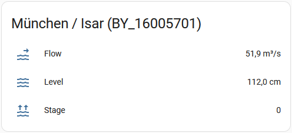

# hochwasserportal
Home Assistant integration for [Länderübergreifendes Hochwasser Portal](https://www.hochwasserzentralen.de)

Sources
* https://bundesapi.github.io/hochwasserzentralen-api
* https://github.com/bundesAPI/hochwasserzentralen-api

# Configuration
1. Copy the sources from `ROOT_OF_THIS_REPO/custom_components/hochwasserportal` to `YOUR_HA_INSTALLATION/config/custom_components/hochwasserportal`
1. Add the following lines to your `configuration.yaml`. Example for the Isar in Munich
```
  - platform: hochwasserportal
    pegel: BY_16005701
    level: True
    stage: True
    flow: True
```
The variables `level`, `stage` and `flow` are optional and default to `True` if not set. If you don't want one of the three sensors to show up you have to set the corresponding variable to `False`.  
**A full list of valid pegels can be found here [here](./pegel.md).**
1. After **restarting** your Home Assistant installation the following three sensors should show up.
